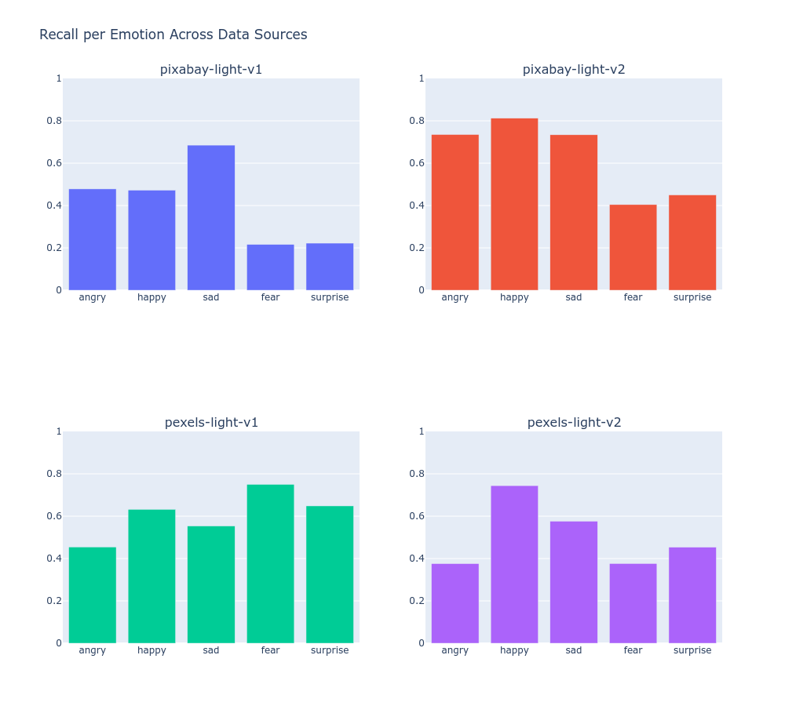

# Expressions Ensemble: Methods

## Motivation & Goals

Expressions Ensemble (ExE) demonstrates an end-to-end pipeline for collecting images with minimal manual curation for classification with ecological validity. Classification of emotional expressions often struggles to bridge the gap between controlled datasets and "in the wild" expressions. Reported metrics here inform how this approach performs across multiple validation scenarios.

### Multiple Validation
- **Ecological**: Facial expressions from well known movies are extracted and classified. Although accuracy on individual faces is not assessed here, clear patterns support that the approach generalizes well.
- **Standardized**: Evaluation against two established datasets of emotional facial expressions (FER 2013, RAF-DB) provides comparison with established 
- **Performance**: Classification metrics, confusion matrices, and performance metrics demonstrate that this process yields stable signal with minimal curation.

## Keyword Strategy & Search Design

Two search patterns were tested across two stock photo APIs:

- **Face-specific:** `"[emotion] face"` (e.g., "happy face")
- **Multi-keyword:** Multiple adjectives per emotion (e.g., "happy", "smiling", "joyful")

| Emotion   | Keywords                              |
|-----------|---------------------------------------|
| Angry     | "angry", "mad", "irate"              |
| Fear      | "fear", "afraid", "scared"           |
| Happy     | "happy", "smiling", "joyful"         |
| Sad       | "sad", "crying", "unhappy"           |
| Surprise  | "surprised", "shocked", "astonished" |

**Dropped classes:** Disgust was removed due to low hit counts across both APIs. Neutral was removed due to ambiguity — future work may consider low-confidence predictions on trained emotions as an indicator of neutral-type expressions.

## Experiment Tracking & Model Selection

Four training runs were tracked via MLflow, varying data source (Pixabay, Pexels) and data version (v1, v2).

### Recall by Data

### MLflow Experiment Summary

| run_name   |   total_samples |   class_fear_count |   class_surprise_count |   class_sad_count |   class_happy_count |   class_angry_count |   recall_happy |   recall_sad |   recall_fear |   recall_surprise |   recall_angry |
|:------------------|-----------------------:|--------------------------:|------------------------------:|-------------------------:|---------------------------:|---------------------------:|-----------------------:|---------------------:|----------------------:|--------------------------:|-----------------------:|
| pixabay-light-v1  |                   1553 |                       189 |                            90 |                      363 |                        451 |                        460 |               0.472527 |             0.684932 |              0.216216 |                  0.222222 |               0.478261 |
| pixabay-light-v2  |                   2132 |                       233 |                           203 |                      542 |                        988 |                        166 |               0.812183 |             0.733945 |              0.404255 |                  0.45     |               0.735294 |
| pexels-light-v1   |                   2242 |                       400 |                           454 |                      513 |                        437 |                        438 |               0.632184 |             0.553398 |              0.75     |                  0.648352 |               0.454545 |
| pexels-light-v2   |                   4517 |                       887 |                           863 |                     1047 |                       1058 |                        662 |               0.744076 |             0.57619  |              0.376404 |                  0.453488 |               0.37594  |

### Why an Ensemble?

Each data source capture unique and varied emotional data. Imbalances in classes and learning were balanced with the ensemble approach. Combining data source for training would add noise to potentially good signal. 

## Design Decisions & Generalizability

### Why Face Detection Was Critical

This approach relied on MediaPipe's face detector for several reasons:

1. **Consistent framing:** Stock photos contain full scenes; face detection isolates the relevant emotional signal
2. **Domain alignment:** Training crops must match inference crops
3. **Noise reduction:** Filters out images with no faces, multiple faces, etc.

**Implication for generalization:** This approach is specific to facial emotion recognition. Extending to full-body emotions, activities, or object states would require different detectors and likely different keyword strategies.

### Why This Approach May Generalize

The core principle — multi-keyword weak supervision matched to validation domain — likely transfers to other classification problems where labeled data is scarce but keyword-searchable images are abundant. The validation methodology (temporal patterns in narrative content) could extend to any domain with interpretable temporal structure.
