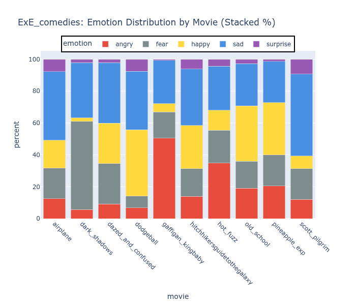
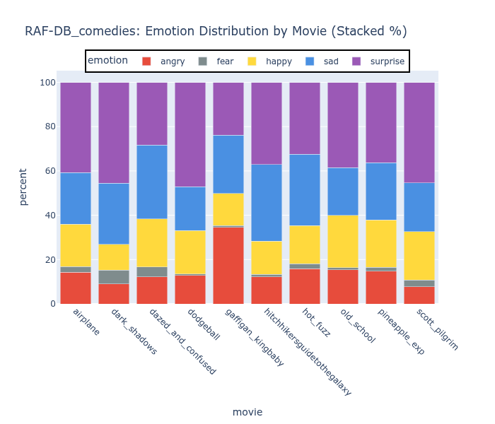
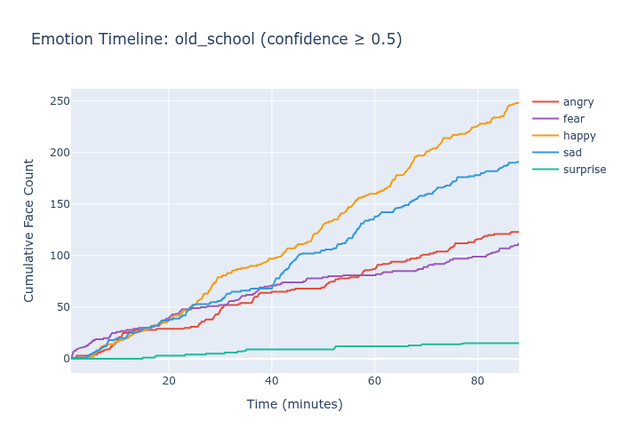
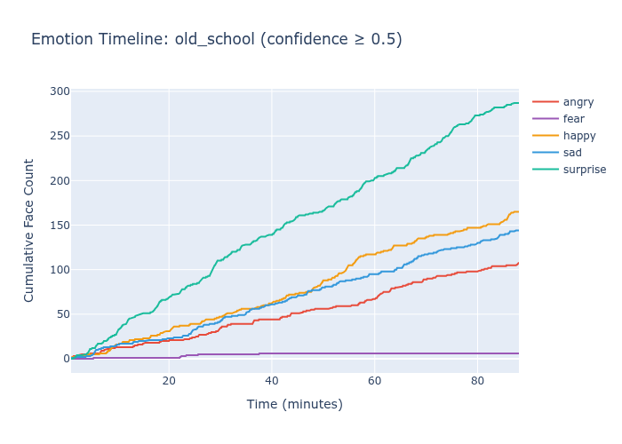
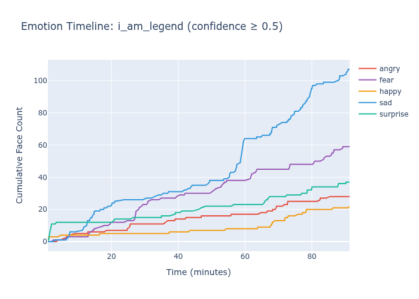
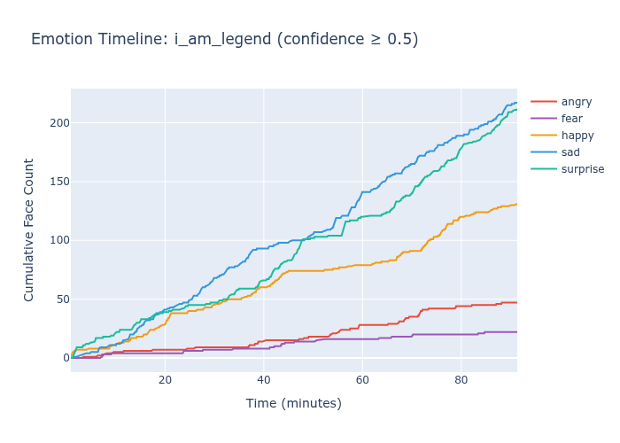
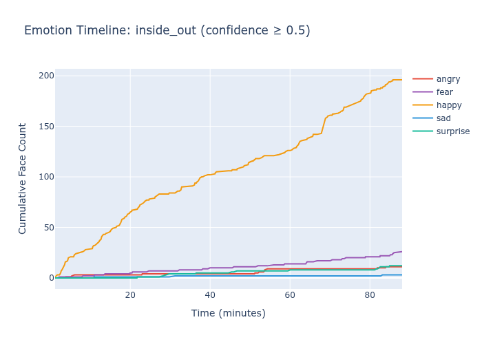
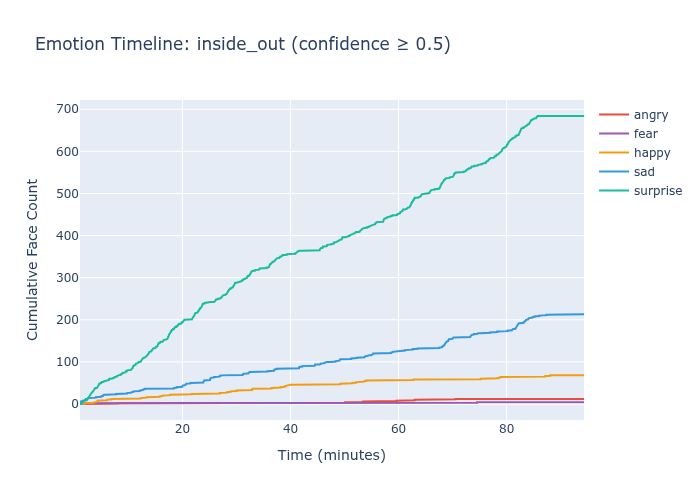

# Exaggerated Expressions: Addressing Domain Gap in Emotion Recognition via Weak Supervision

A study of facial emotion classification probing the domain gap between exaggerated lab benchmarks and real-world film, built on a curation-free, weakly supervised web pipeline designed for ecological performance. 

## The Gap at a Glance

Comedies should look happy. Only one of these models agrees.

ExE (Weak Supervision)             |  RAF-DB (Curated Labels)
:-------------------------:|:-------------------------:
  |  

The ExE model — trained on ~2,000 stock photos with zero manual labeling — captures genre-appropriate emotion distributions across comedies. The RAF-DB model — trained on 15,000+ hand-labeled images with 90% test accuracy — collapses most predictions into surprise regardless of genre.

A **paired t-test across these movies** confirms this isn't cherry-picked: ExE predicts significantly more happy expressions than RAF-DB (*p* < .05), while RAF-DB predicts significantly more surprise (*p* < .05). The models diverge systematically, not randomly.

## Project Overview

**Problem:** Standard emotion recognition datasets (FER2013, RAF-DB) achieve high benchmark accuracy but often fail to generalize to real-world validation tasks like movie analysis.

**Approach:** Train emotion classifiers using keyword-based weak supervision from stock photo platforms (Pexels, Pixabay), then validate on movie timelines to assess ecological validity.

**Key Finding:** Models trained on domain-matched data with weak supervision (71% accuracy) show more interpretable patterns and emotional diversity than models trained on curated datasets with 90% accuracy.

## TOC
- [Results Summary](#results-summary)
- [Technical Approach](#technical-approach)
- [Validation Methodology](#validation-methodology)
- [Limitations & Future Work](#limitations--future-work)
- [Repository Structure](#repository-structure)
- [Installation and Usage](#installation--usage)
- [Key Takeaways](#key-takeaways)
- [Citation and Contact](#citation--contact)
- [Acknowledgments](#acknowledgments)
- [License](#license)

Additional details available for [Methods](METHODS.md) and [Results](RESULTS.md).

## Results Summary

### Model Comparison

| Model | Test Accuracy | Narrative Patterns |
|-------|--------------|-------------|
| ExE (Weak Supervision) | 71% | Interpretable |
| RAF-DB (Labeled Data) | 90% | Minimal |
| FER2013 (Lab Dataset) | 71% | None (98% angry) |

### Emotion Distribution Across All Movies

ExE             |  RAF-DB
:-------------------------:|:-------------------------:
  |  

### Key Findings

1. **Multi-keyword semantic breadth:** Combining multiple emotion keywords (`happy+smiling+joyful`) produces better results than single keywords, replicated across Pexels and Pixabay sources

2. **Domain matching matters:** Stock photos with emotional context better match movie expressions than lab poses (FER2013) or in-the-wild selfies (RAF-DB)

3. **Benchmark accuracy ≠ ecological validity:** The 90% accurate RAF-DB model collapses to predicting 'surprise' in most movies with flat timelines, while the 71% accurate ExE model captures narrative-relevant emotional shifts

4. **Minimal data requirements:** ~2,000 weakly-labeled images across 5 emotion classes sufficient for meaningful patterns

5. **Statistical confirmation:** Paired t-tests show significant differences in happy and surprise predictions between models — the divergence is systematic, not noise

## Technical Approach
[Back to Top](#toc)

### Data Collection & Curation

**Sources:** Pexels and Pixabay APIs  
**Keywords tested:**
- Single emotion: `[emotion] face` (e.g., "happy face")
- Multiple adjectives: `happy + smiling + joyful`
- Result: Multi-keyword approach consistently outperformed single-keyword

**Curation:**
- Automated keyword-based labeling (no manual annotation)
- Dropped `disgust` and `neutral` classes due to low hits and ambiguity
- Final dataset: 2,132 images across 5 classes (angry, fear, happy, sad, surprise)

### Model Architecture

- **Base:** ResNet18 pretrained on ImageNet
- **Transfer learning:** Fine-tuned layer3, layer4, and fc (~94% of parameters trainable)
- **Face detection:** MediaPipe
- **Framework:** PyTorch
- **Tracking:** MLflow for experiment management

### Training Details

- **Classes:** 5 emotions (angry, fear, happy, sad, surprise)
- **Training data:** 2,132 total images (1,705 train / 427 validation) with class imbalance:
  - Happy: 988 · Sad: 542 · Fear: 233 · Surprise: 203 · Angry: 166
- **Augmentation:** Light (flips, rotations, color jitter)
- **Best validation accuracy:** 71.0%

See [Methods](METHODS.md) for a full comparison of all 9 training runs and the rationale behind model selection.

## Validation Methodology
[Back to Top](#toc)

### Movie Timeline Analysis

**Approach:** Analyze 50+ full-length films, tracking emotion predictions every 100th frame to assess whether models capture narrative structure.

**Success criteria:**
- Temporal variation rather than flat predictions
- Genre-appropriate emotion distributions (comedies show more happy, dramas show more sad)
- Emotional shifts align with key plot points (reunions, conflicts, resolutions)

### Statistical Comparison

A paired t-test across all movies compared the proportion of each emotion predicted by ExE vs. RAF-DB. Key results:

- ExE predicts significantly **more happy** expressions (*p* < .05)
- RAF-DB predicts significantly **more surprise** expressions (*p* < .05)
- These differences are consistent across genres, not driven by outliers

### Example Validations

**Old School (Comedy):**
- Brief synopsis: Movie contains lots of smiling and laughing
- ExE: Happy is high throughout and surge visible in final portion
- RAF-DB: Surprise is high throughout

ExE             |  RAF-DB
:-------------------------:|:-------------------------:
  |  

**I Am Legend (Sci-Fi, Horror):**
- Brief synopsis: Post-apocalyptic zombie horror film
- ExE: Fear and sadness prominent throughout
- RAF-DB: Surprise and sadness prominent throughout

ExE             |  RAF-DB
:-------------------------:|:-------------------------:
  |  


**Inside Out (Kid's Animation):**
- Brief synopisi: Animated movie about emotions featuring Joy, Sadness, Anger, Disgust, & Fear
- ExE: Blend of emotions with happy, sad, and fear most common
- RAF-DB: Surprise dominates entire film

ExE             |  RAF-DB
:-------------------------:|:-------------------------:
  |  


## Limitations & Future Work
[Back to Top](#toc)

### Current Limitations

1. **Fear/Sad bias:** ExE over predicts some emotions as shown by it being dominate emotion in unexpectedly higher percent of all movies: fear (46%) and sad (38%). This is likely due to keyword-based training data over-representing neutral/contemplative expressions or a high number of movie frames with speaking (open mouth expressions)

2. **Subjective validation:** Timeline patterns assessed qualitatively; systematic quantitative validation needed beyond t-tests

3. **No ground truth:** Movie emotional arcs based on plot knowledge, not standardized annotations

4. **Single architecture:** All comparisons use ResNet18; results may differ with other architectures

### Future Directions

1. **Solve fear/sad bias:** Investigate keyword selection, data balancing, or post-hoc calibration
2. **Systematic validation:** Quantitative metrics for timeline quality, inter-rater reliability
3. **Domain generalization:** Test on hand gestures, activities (demonstrating approach transfers)
4. **Ablation studies:** Isolate contribution of each keyword, data source effects

## Repository Structure
[Back to Top](#toc)

```
exaggerated-expressions/
├── configs/
│   ├── aggregation_mixing/  # Datasource combinations
│   ├── data_pull/        # API/search criteria
│   └── training/         # Models, augmentation, hyperparameters
├── data/
│   ├── raw/              # Downloaded stock photos
│   ├── processed/        # Face crops, train/val splits
│   ├── FER-2013          # Standardized data
│   └── RAF-DB            # Standardized data
├── evaluation/           # Movie outputs/model
├── models/
│   ├── exe/              # Trained model checkpoints
│   ├── RAF-DB_comparison/   # RAF-DB baseline
│   └── fer_comparison/   # FER2013 baseline
├── notebooks/
│   ├── model_metrics_and_comparison.ipynb
│   ├── movie_evaluation_and_comparison.ipynb
│   ├── training_file_exe.ipynb 
│   ├── training_file_for_FER2013.ipynb
│   └── training_file_for_RAF.ipynb
├── src/
│   ├── api_pulls/            # API requests
│   ├── movie_evaluation/     # Movie specific analysis
│   ├── utils/                # Common shared functions
│   ├── batch_runner.py       # Run multiple trainings
│   ├── face_extraction.py    # Creates face images based on pulled data
│   ├── model_config.py       # Shared model and augmentation settings
│   └── train_from_config.py  # Train a single model
├── README.md                 # Project overview
├── METHODS.md                # Data curation, model selection, and experiment tracking
├── RESULTS.md                # Detailed metrics and cross-model comparison
└── environment.yml           # Packages and versions
```

### NOTE: Raw data is not shared, must collect from original sources

## Installation & Usage
[Back to Top](#toc)

```bash
# Clone repository
git clone https://github.com/pixel-process/exaggerated-expressions.git
cd exaggerated-expressions

# Install dependencies
conda env create -f environment.yml
```

### Additional Software/Access
  - MediaPipe FaceDetector
  - ResNet for PyTorch
  - API key for relevant sources
  - Data for training

### Run Pipeline

```bash
# Pull data based on config
python src/api_pulls/pixabay_pull.py ../configs/data_pull/pixabay_v1.json

# Extract Faces
python src/face_extraction.py --raw_dir data/raw/pixabay_v1 --out_dir data/processed/pixabay_v1

# EDA/clean pulled data:
# notebooks/training_curation.ipynb 

# Train model 
python src/train_from_config.py --config configs/training/pixabay_v1

# Model metrics (designed for multiple comparison and test datasets):
# notebooks/model_metrics_and_comparison.ipynb

# Run movie analysis with mlflow run id
python src/movie_evaluation/evaluate_movies.py \
    --checkpoint models/pixabay_light_v2/model.pt \
    --movies-dir ~/Movies \
    --movie-list src/movie_evaluation/movie_list.txt \
    --output-dir ../../evaluation/pixabay_v2/movies \
    --face-detector ../../models/mediapipe_face_detector/detector.tflite

# Movie evaluation:
# notebooks/movie_evaluation_and_comparison.ipynb
```

## Key Takeaways
[Back to Top](#toc)

**For ML Practitioners:**
- Benchmark accuracy doesn't guarantee real-world generalization
- Domain matching can be more important than data quality or quantity
- Weak supervision is viable for practical applications
- Validation methodology matters as much as model architecture

**For Applied Projects:**
- ~2,000 weakly-labeled images sufficient for meaningful patterns
- Multi-keyword search improves data quality over single-keyword
- Movie timelines provide interpretable ecological validation
- Transfer learning + minimal data = practical approach

## Technical Stack

- **Languages:** Python 3.10+
- **ML Framework:** PyTorch
- **Base Architecture:** ResNet18
- **Data Processing:** Polars
- **Computer Vision:** MediaPipe (face detection), OpenCV
- **Visualization:** Plotly
- **Experiment Tracking:** MLflow
- **APIs:** Pexels, Pixabay

## Citation & Contact
[Back to Top](#toc)

### Citation
If you use this work, please cite:

```bibtex
@misc{lumian2025exe,
  author = {Lumian, Daniel},
  title = {Exaggerated Expressions: Emotion Recognition via Keyword-Based Weak Supervision},
  year = {2025},
  url = {https://github.com/pixel-process/exaggerated-expressions}
}
```
### Contact

Daniel Lumian, PhD  
[Dexterous Data](https://www.dexterousdata.com)  
dexterous.data.llc@gmail.com

For consulting inquiries on ML prototyping and validation methodology, please reach out.

## Acknowledgments
[Back to Top](#toc)

- Stock photo sources: Pexels and Pixabay APIs
- Face detection: MediaPipe by Google
- Base architecture: ResNet18 (PyTorch pretrained)
- Baseline datasets: RAF-DB, FER2013

## License
[Back to Top](#toc)

MIT License — see [LICENSE](LICENSE) for details.

---

**Note:** This is a research and portfolio project demonstrating applied ML methodology. The models are not intended for production use without further validation and bias mitigation.

**Model Availability:** Pre-trained weights are not provided as the model is easily reproducible in 2-3 hours using the provided training pipeline. The full codebase, training configuration, and dataset collection scripts are included for complete reproducibility. For specific use cases requiring pre-trained weights, please contact dexterous.data.llc@gmail.com.

[Back to Top](#toc)
