# Expressions Ensemble: Addressing Domain Gap in Emotion Recognition via Weak Supervision

A study of facial emotion classification probing the domain gap between exaggerated lab benchmarks and real-world film, built on a curation-free, weakly supervised web pipeline designed for ecological performance. 

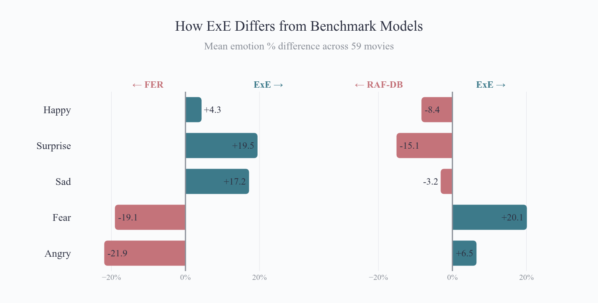

## The Gap at a Glance


Movie genres should show variation in emotional expression:
- More happy expressions in comedies
- More negative experessions in crime

### Comedy Movies

| ExE (Weak Supervision)      |  RAF-DB (Curated Labels)      |  FER (Curated Labels) |
:-------------------------:|:-------------------------:|:-------------------------:|
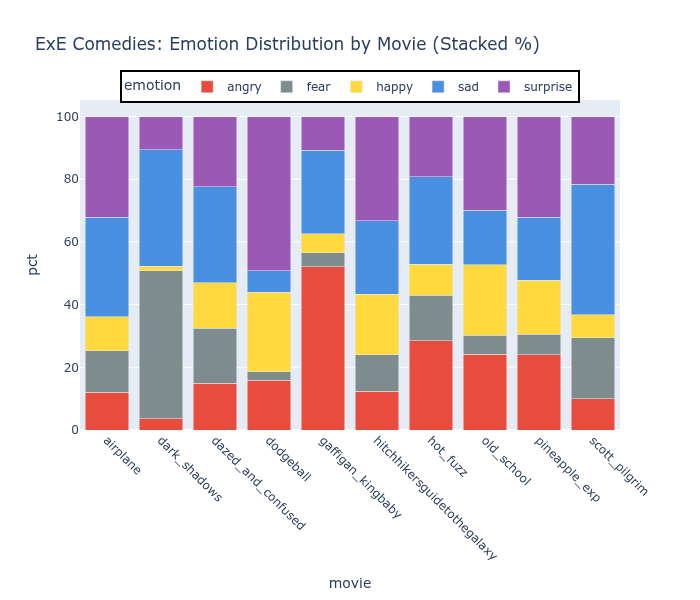  |  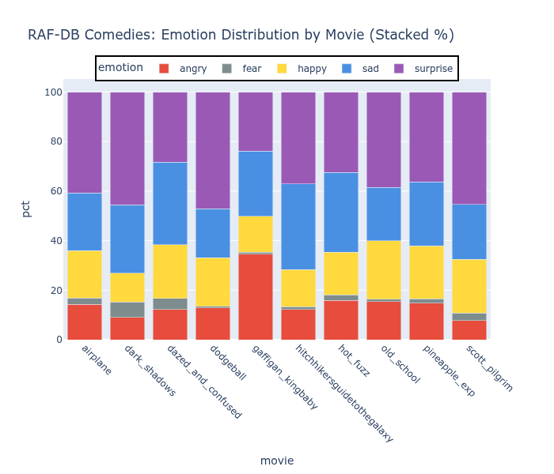 |   |

### Crime Movies

| ExE (Weak Supervision)      |  RAF-DB (Curated Labels)      |  FER (Curated Labels) |
:-------------------------:|:-------------------------:|:-------------------------:|
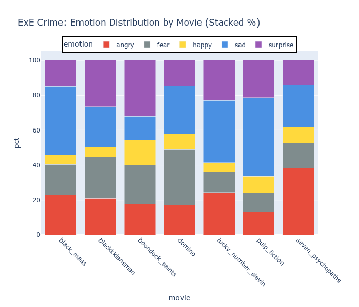  |  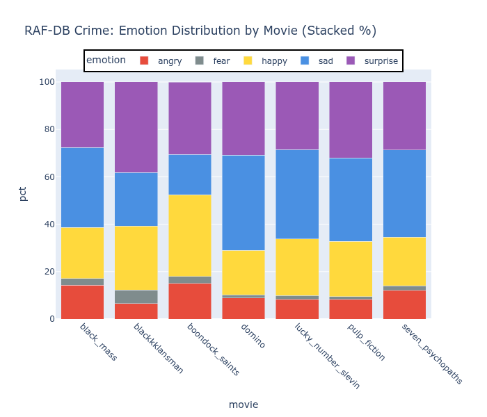 |  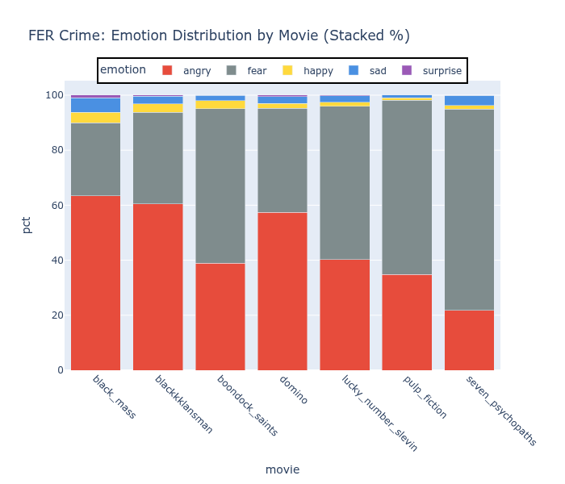 |


The ExE model — using a 4 model ensemeble approach trained on a total of ~10,000 stock photos with zero manual labeling — captures genre-appropriate emotion distributions across comedies and crime flicks. The RAF-DB model — trained on 15,000+ hand-labeled images with 90% test accuracy — collapses most predictions into surprise and sad regardless of genre. The FER trained model shows a similar collapse but into anger and fear. 

## Project Overview

**Problem:** Standard emotion recognition datasets (FER2013, RAF-DB) achieve high benchmark accuracy but often fail to generalize to real-world validation tasks like movie analysis.

**Approach:** Train emotion classifiers using keyword-based weak supervision from stock photo platforms (Pexels, Pixabay), then validate on movie timelines to assess ecological validity.

**Key Finding:** Four models trained on domain-matched data with weak supervision (48-71% accuracy) show more interpretable patterns and emotional diversity than models trained on curated datasets with 90% accuracy.

## TOC
- [Results Summary](#results-summary)
- [Technical Approach](#technical-approach)
- [Validation Methodology](#validation-methodology)
- [Limitations & Future Work](#limitations--future-work)
- [Repository Structure](#repository-structure)
- [Installation and Usage](#installation--usage)
- [Key Takeaways](#key-takeaways)
- [Citation and Contact](#citation--contact)
- [Acknowledgments](#acknowledgments)
- [License](#license)

Additional details available for [Methods](METHODS.md).

## Results Summary

### Model Comparison

| Model | Test Accuracy | Narrative Patterns |
|-------|--------------|-------------|
| ExE (Weak Supervision) | 48-71% | Interpretable |
| RAF-DB (Labeled Data) | 90% | Minimal |
| FER2013 (Lab Dataset) | 71% | None (98% angry) |

### Emotion Distribution Across All Movies

ExE             |  RAF-DB        |  FER 2013
:-------------------------:|:-------------------------:|:-------------------------: 
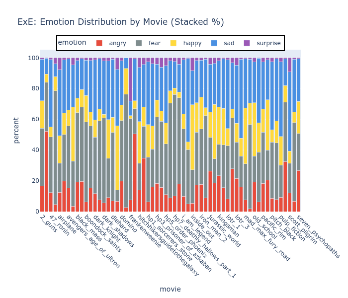  |  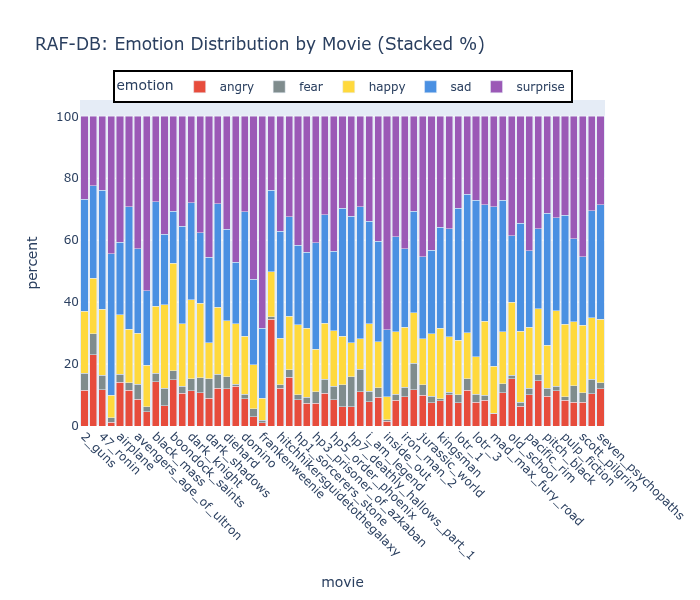 |  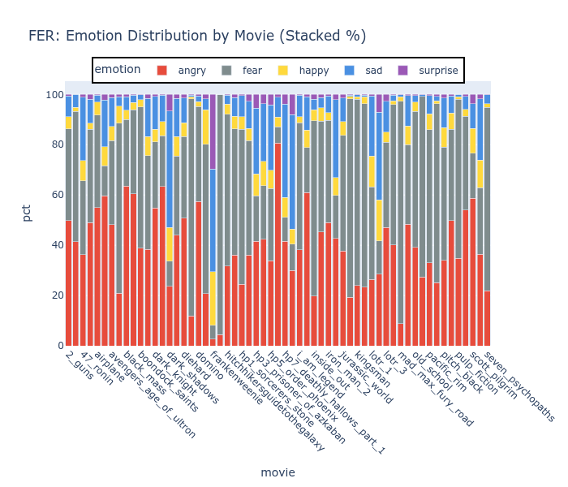

### Key Findings

1. **Weak supervision with multiple searches:** Multiple emotion keywords searches set up as `happy face` or broader terms (`happy+smiling+joyful`) provide coverage of multiple classes with distinct patterns of model bias.

2. **Domain matching matters:** Stock photos with emotional context better match movie expressions than lab poses (FER2013) or in-the-wild selfies (RAF-DB)

3. **Benchmark accuracy ≠ ecological validity:** Both benchmark trained models tend to collapse towards 1 or 2 emotion expressions on the movie evaluation. However, multiple weak learners provide more expected patterns across genre and movie timeline.

4. **Minimal data requirements:** 4 models each using between 1,500 and 4,600 weakly-labeled images across 5 emotion classes was sufficient for meaningful patterns


## Technical Approach
[Back to Top](#toc)

### Data Collection & Curation

**Sources:** Pexels and Pixabay APIs  
**Keywords tested:**
- Single emotion: `[emotion] face` (e.g., "happy face")
- Multiple adjectives: `happy + smiling + joyful`
- Result: Variation in search provides distinct training materials for ensemble learning

**Curation:**
- Automated keyword-based labeling (no manual annotation)
- Dropped `disgust` and `neutral` classes due to low hits and ambiguity
- Imbalance across classes was the result of images collected and not manually addressed

### Final Training Data by Model
| run_name   |   total_samples |   fear_count |   surprise_count |   sad_count |   happy_count |   angry_count |
|:------------------|-----------------------:|--------------------------:|------------------------------:|-------------------------:|---------------------------:|---------------------------:|
| pixabay-light-v1  |                   1553 |                       189 |                            90 |                      363 |                        451 |                        460 |
| pixabay-light-v2  |                   2132 |                       233 |                           203 |                      542 |                        988 |                        166 |
| pexels-light-v1   |                   2242 |                       400 |                           454 |                      513 |                        437 |                        438 |
| pexels-light-v2   |                   4517 |                       887 |                           863 |                     1047 |                       1058 |                        662 |

### Model Architecture

- **Base:** ResNet18 pretrained on ImageNet
- **Transfer learning:** Fine-tuned layer3, layer4, and fc (~94% of parameters trainable)
- **Face detection:** MediaPipe
- **Framework:** PyTorch
- **Tracking:** MLflow for experiment management

### Training Details

- **Classes:** 5 emotions (angry, fear, happy, sad, surprise)
- **Training data:** 80-20 split was applied for each data
- **Augmentation:** Light (flips, rotations, color jitter)
- **Best validation accuracy:** 71.0%

See [Methods](METHODS.md) for a full comparison of all training runs and the rationale behind model selection.

## Validation Methodology
[Back to Top](#toc)

### Movie Timeline Analysis

**Approach:** Analyze 50+ full-length films, tracking emotion predictions every 100th frame to assess whether models capture narrative structure.

**Success criteria:**
- Temporal variation rather than flat predictions
- Genre-appropriate emotion distributions (comedies show more happy, dramas show more sad)
- Emotional shifts align with key plot points (reunions, conflicts, resolutions)

### Example Validations

**Hitchhikers Guide to the Galaxy (Comedy):**
- Brief synopsis: Space adventure comedy
- ExE: Strong mix of emotions with an increase of happy ~92 minutes tracking the happy ending
- RAF-DB: High levels of surprise and sadness, no fear detection
- FER 2013: Dominated by fear

ExE             |  RAF-DB             |  FER2013
:-------------------------:|:-------------------------:|:-------------------------:
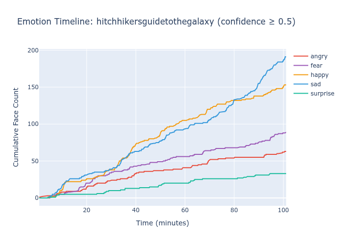  |  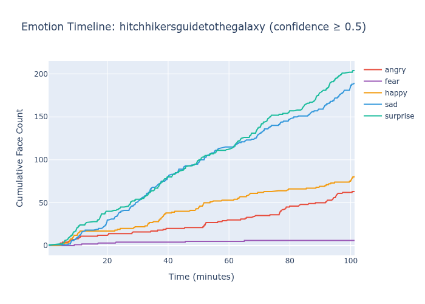 |  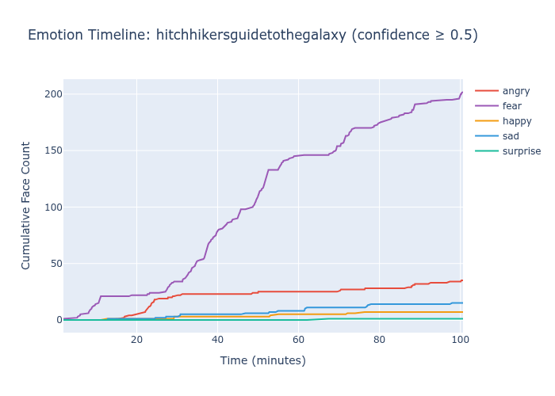


**Big Hero 6 (Kid's Animation Adventure):**
- Brief synopsis: Animated super hero story (note: transfer to animation presents a challenge)
- ExE: Strong mix of emotions with sharp changes in trajectory througout
- RAF-DB: Surpise and sad highest with slow, steady increases
- FER 2013: Fear is almost only predicted emotion

ExE             |  RAF-DB             |  FER2013
:-------------------------:|:-------------------------:|:-------------------------:
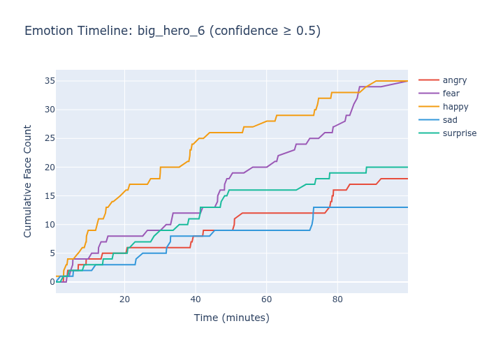  |  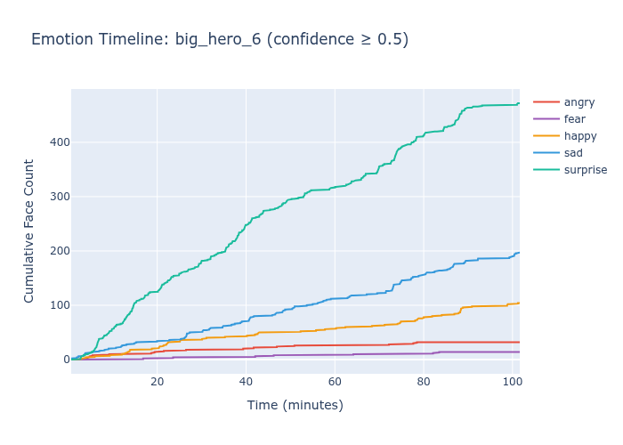 |  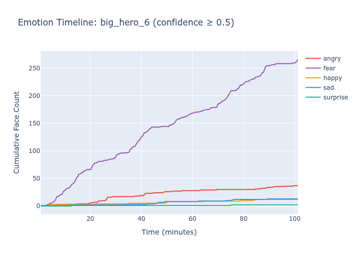

**Boondock Saints (Crime):**
- Brief synopsis: Two brothers wage a personal war on the mob, plenty of action, drama, and some laughs
- ExE: Surprise and fear come in top but with all emotions present
- RAF-DB: Surpise and happy highest with very little fear detected
- FER 2013: Fear is basically only predicted emotion

ExE             |  RAF-DB             |  FER2013
:-------------------------:|:-------------------------:|:-------------------------:
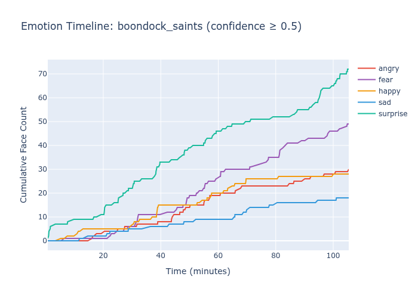  |  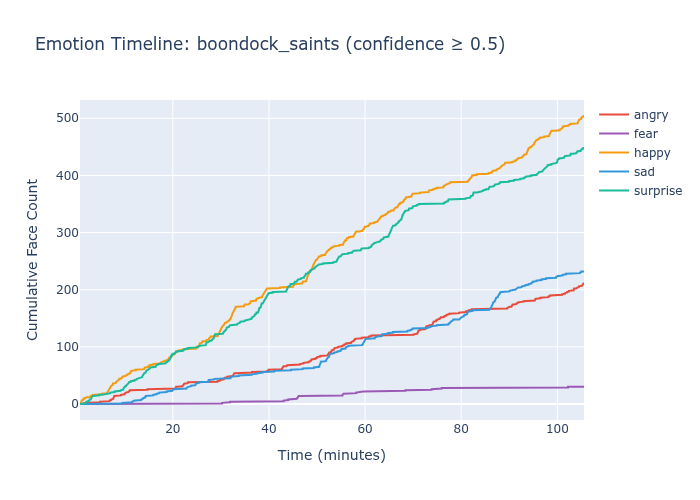 |  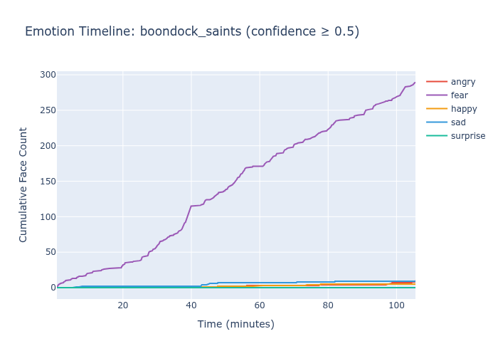


## Limitations & Future Work
[Back to Top](#toc)

### Current Limitations

1. **Sad bias:** ExE over predicts some emotions as shown by it being dominate emotion in approximate half of the films. This is likely due to keyword-based training data over-representing neutral/contemplative expressions or a high number of movie frames with speaking (open mouth expressions)

2. **Subjective validation:** Timeline patterns assessed qualitatively; systematic quantitative validation needed

3. **No ground truth:** Movie emotional arcs based on plot knowledge, not standardized annotations

4. **Single architecture:** All comparisons use ResNet18; results may differ with other architectures

### Future Directions

1. **Solve sad bias:** Investigate keyword selection, data balancing, or post-hoc calibration
2. **Systematic validation:** Quantitative metrics for timeline quality, inter-rater reliability
3. **Domain generalization:** Test on hand gestures, activities (demonstrating approach transfers)
4. **Ablation studies:** Isolate contribution of each keyword, data source effects

## Repository Structure
[Back to Top](#toc)

```
expressions-ensemble/
├── configs/
│   ├── aggregation_mixing/  # Datasource combinations
│   ├── data_pull/        # API/search criteria
│   └── training/         # Models, augmentation, hyperparameters
├── data/
│   ├── raw/              # Downloaded stock photos
│   ├── processed/        # Face crops, train/val splits
│   ├── FER-2013          # Standardized data
│   └── RAF-DB            # Standardized data
├── evaluation/           # Movie outputs/model
├── models/
│   ├── exe/              # Trained model checkpoints
│   ├── RAF-DB_comparison/   # RAF-DB baseline
│   └── fer_comparison/   # FER2013 baseline
├── notebooks/
│   ├── model_metrics_and_comparison.ipynb
│   ├── movie_evaluation_and_comparison.ipynb
│   ├── training_file_exe.ipynb 
│   ├── training_file_for_FER2013.ipynb
│   └── training_file_for_RAF.ipynb
├── src/
│   ├── api_pulls/            # API requests
│   ├── movie_evaluation/     # Movie specific analysis
│   ├── utils/                # Common shared functions
│   ├── batch_runner.py       # Run multiple trainings
│   ├── face_extraction.py    # Creates face images based on pulled data
│   ├── model_config.py       # Shared model and augmentation settings
│   └── train_from_config.py  # Train a single model
├── README.md                 # Project overview
├── METHODS.md                # Data curation, model selection, and experiment tracking
└── environment.yml           # Packages and versions
```

### NOTE: Raw data is not shared, must collect from original sources

## Installation & Usage
[Back to Top](#toc)

```bash
# Clone repository
git clone https://github.com/pixel-process/expressions-ensemble.git
cd expressions-ensemble

# Install dependencies
conda env create -f environment.yml
```

### Additional Software/Access
  - MediaPipe FaceDetector
  - ResNet for PyTorch
  - API key for relevant sources
  - Data for training

### Run Pipeline

```bash
# Pull data based on config
python src/api_pulls/pixabay_pull.py ../configs/data_pull/pixabay_v1.json

# Extract Faces
python src/face_extraction.py --raw_dir data/raw/pixabay_v1 --out_dir data/processed/pixabay_v1

# EDA/clean pulled data:
# notebooks/training_curation.ipynb 

# Train model 
python src/train_from_config.py --config configs/training/pixabay_v1

# Model metrics (designed for multiple comparison and test datasets):
# notebooks/model_metrics_and_comparison.ipynb

# Run movie analysis with mlflow run id
python src/movie_evaluation/evaluate_movies.py \
    --checkpoint models/pixabay_light_v2/model.pt \
    --movies-dir ~/Movies \
    --movie-list src/movie_evaluation/movie_list.txt \
    --output-dir ../../evaluation/pixabay_v2/movies \
    --face-detector ../../models/mediapipe_face_detector/detector.tflite

# Movie evaluation:
# notebooks/movie_evaluation_and_comparison.ipynb
```

## Key Takeaways
[Back to Top](#toc)

**For ML Practitioners:**
- Benchmark accuracy doesn't guarantee real-world generalization
- Domain matching can be more important than data quality or quantity
- Weak supervision is viable for practical applications
- Validation methodology matters as much as model architecture

**For Applied Projects:**
- 4 models train on <5,000 weakly-labeled images each was sufficient for meaningful patterns
- Multi-keyword search improves data quality over single-keyword
- Movie timelines provide interpretable ecological validation
- Transfer learning + minimal data = practical approach

## Technical Stack

- **Languages:** Python 3.10+
- **ML Framework:** PyTorch
- **Base Architecture:** ResNet18
- **Data Processing:** Polars
- **Computer Vision:** MediaPipe (face detection), OpenCV
- **Visualization:** Plotly
- **Experiment Tracking:** MLflow
- **APIs:** Pexels, Pixabay

## Citation & Contact
[Back to Top](#toc)

### Citation
If you use this work, please cite:

```bibtex
@misc{lumian2025exe,
  author = {Lumian, Daniel},
  title = {Expressions Ensemble: Emotion Recognition via Keyword-Based Weak Supervision},
  year = {2025},
  url = {https://github.com/pixel-process/expressions-ensemble}
}
```
### Contact

Daniel Lumian, PhD  
[Dexterous Data](https://www.dexterousdata.com)  
dexterous.data.llc@gmail.com

For consulting inquiries on ML prototyping and validation methodology, please reach out.

## Acknowledgments
[Back to Top](#toc)

- Stock photo sources: Pexels and Pixabay APIs
- Face detection: MediaPipe by Google
- Base architecture: ResNet18 (PyTorch pretrained)
- Baseline datasets: RAF-DB, FER2013

## License
[Back to Top](#toc)

MIT License — see [LICENSE](LICENSE) for details.

---

**Note:** This is a research and portfolio project demonstrating applied ML methodology. The models are not intended for production use without further validation and bias mitigation.

**Model Availability:** Pre-trained weights are not provided for models. The full codebase, training configuration, and dataset collection scripts are included for reproducibility. For specific use cases requiring pre-trained weights, please contact dexterous.data.llc@gmail.com.

[Back to Top](#toc)
