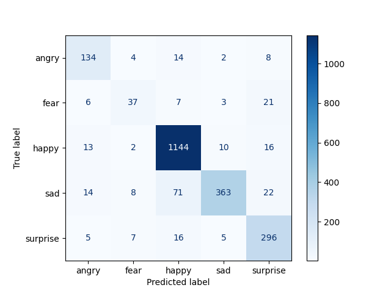

# Exaggerated Expressions: Results

## ExE Model (Pixabay V2): Validation Metrics

### Classification Report

```text
              precision    recall  f1-score   support

       angry       0.58      0.74      0.65        34
        fear       0.47      0.40      0.44        47
       happy       0.83      0.81      0.82       197
         sad       0.65      0.73      0.69       109
    surprise       0.62      0.45      0.52        40

    accuracy                           0.71       427
   macro avg       0.63      0.63      0.62       427
weighted avg       0.71      0.71      0.70       427
```

### Confusion Matrix


**Notes:** Validation set is the 20% holdout from the Pixabay V2 data (427 images). The metrics above reflect the model's ability to classify stock-photo-style faces — the domain it was trained on. Ecological validity (how well it generalizes to movies) is assessed separately below.

## RAF-DB Model: Test Metrics

Standard test set for evaluation of RAF-DB models. Represents internal validity of this dataset.

### Classification Report

```text
              precision    recall  f1-score   support

       angry       0.89      0.81      0.85       162
        fear       0.66      0.53      0.59        74
       happy       0.94      0.96      0.95      1185
         sad       0.92      0.84      0.88       478
    surprise       0.82      0.92      0.86       329

    accuracy                           0.90      2228
   macro avg       0.85      0.81      0.83      2228
weighted avg       0.90      0.90      0.90      2228
```

### Confusion Matrix


## Cross-Domain Performance: ExE on RAF-DB Test

To assess how the ExE model handles data from a different domain, it was evaluated on RAF-DB's standard test set. Performance was poor, as expected given the domain gap.

```text
              precision    recall  f1-score   support

       angry       0.25      0.41      0.31       162
        fear       0.03      0.32      0.06        74
       happy       0.76      0.53      0.63      1185
         sad       0.52      0.37      0.44       478
    surprise       0.86      0.11      0.20       329

    accuracy                           0.42      2228
   macro avg       0.49      0.35      0.33      2228
weighted avg       0.66      0.42      0.48      2228
```

### Confusion Matrix


This result is expected and actually reinforces the project's thesis: the two models are trained on different domains, and each performs well on its own domain. The question is which domain better matches real-world expressions — and movie validation suggests ExE's domain does.

## Ecological Validation: Movie Analysis

### Emotion Distributions

#### All Movies 50+ films)

ExE             |  RAF-DB
:-------------------------:|:-------------------------:
  |  

The ExE model shows varied emotion distributions across movies with genre-appropriate patterns. The RAF-DB model shows a dominant surprise/sadness prediction across nearly all films, with limited differentiation between genres.

#### Comedy Subset (10 films)

ExE             |  RAF-DB
:-------------------------:|:-------------------------:
  |  

Comedies provide a clear test: these films should show elevated happy predictions. The ExE model reflects this expectation — films like *Old School*, *Pineapple Express*, and *Gaffigan: King Baby* show prominent happy segments. The RAF-DB model shows surprise as the dominant prediction for nearly every comedy.

### Statistical Comparison: Paired t-test

A paired t-test compared the proportion of each emotion predicted by ExE vs. RAF-DB across all movies. Each movie serves as a paired observation.

**Significant differences (p < .05):**
- **Happy:** ExE predicts a significantly higher proportion of happy expressions than RAF-DB
- **Surprise:** RAF-DB predicts a significantly higher proportion of surprise expressions than ExE

These results confirm that the visual patterns in the stacked bar charts reflect systematic model-level differences, not cherry-picked examples.

## Summary

| Aspect | ExE (Pixabay V2) | RAF-DB |
|--------|------------------|--------|
| Training data | 2,132 stock photos | 15,339 labeled faces |
| Test accuracy (own domain) | 71% | 90% |
| Movie emotion diversity | High (varied by genre) | Low (surprise-dominant) |
| Comedy happy detection | Genre-appropriate | Minimal |
| Statistical test | Significantly more happy | Significantly more surprise |

The ExE model trades benchmark accuracy for ecological validity. Whether that tradeoff is worthwhile depends entirely on the use case — but for understanding emotional patterns in real-world media, domain matching appears to matter more than label quality.
